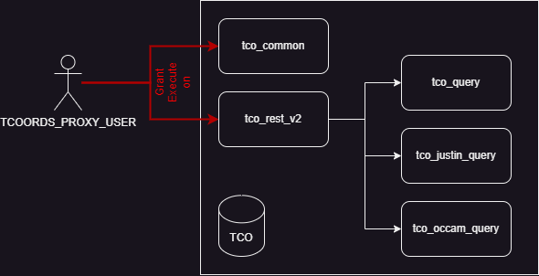
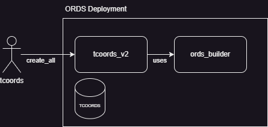
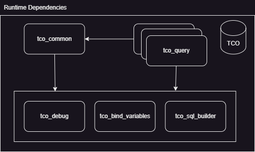

# ORDS Data Access

A set of packages were created to assist in executing various database queries as efficiently as possble. These packages support:

* build dynamic select sql statements without sql injection
* support using bind variables easily
* support paging queries returning the total count
* support user supplied filter criteria including comparions: =, <>, <, >, <=, >=, in, not in, is null on almost any column without coding for each one
* support user supplied order by clause, ordering on one or more columns acscending or descending

## ORDS TCO Endpoints

At present, there is no Open API specifiation for these services

In each endpoint, the filter criteria can be suffixed with the following operator 
suffixes  `_eq`, `_ne`, `_gt`, `_lt`, `_ge`, `_le`, `_in`, `_not_in`, `_is_null`, `_is_not_null`. 
Unless otherwise stated, the string parameters can also have `_like` and `_regexp_like` operator suffixes. 
It is up to the caller to ensure the correct wildcard sequences are used in the parameter value.

### Get TCO Disputes

`GET /v2/tco_disputes`

#### Include Options

Some portions of the TCO dispute record are more expensive to fetch. For those fields that 
involve making a more expensive join, they excluded by default. Callers can request to include
these fields in the response. There is an include parameter that can accept one or more of
these parameters

Query String Parameter: `include=parameter-list`

| Parameter | Notes |
| --------- | --------- |
| appearances | The results should include fields related to the next unresulted appearance | 
| notice_of_hearing_yn | The results should include if there is a notice of hearing |
| multiple_officers_yn | The results should include if there are multiple officers associated with the disput |
| electronic_ticket_yn | The results should include if it is an electronic ticket |

#### Filter Options

Query String Parameters: `parameter_operator=value(s)`

| Parameter | Type | Notes |
| --------- | ---- | --------- |
| dispute_id | number | 
| submitted_dt | datetime | The date and time formatted as an ISO 8601 date |
| jj_decision_dt | datetime | The date and time formatted as an ISO 8601 date |
| to_be_heard_at_agen_id | number |
| hearing_type_cd | string |
| appr_ctrm_agen_id | number |
| appr_ctrm_room_cd | string |
| appr_tm | date | Should be YYYY-MM-DD |
| ticket_number_txt | string |
| prof_surname_nm | string | Will be compared against prof_surname_upper_nm |
| prof_given_1_nm | string | Will be compared against prof_upper_given_1_nm |
| prof_org_nm | string | Will be compared against prof_upper_org_nm |
| prof_surname_nm_or_org_nm | string | Will compare where either prof_surname_nm or prof_org_nm matches. Will be compared against the upper version of the columns |
| vtc_assigned_to | string |
| jj_assigned_to | string |
| occam_violation_ticket_upld_id | number |
| dispute_status_type_cd | string |

#### Order By

Query String Parameter: `order=field-list`

Almost any field can be sorted on. To sort descending, prefix the field with a `-`. For example, `order=prof_surname_nm_or_org_nm,prof_given_1_nm` or 
`order=-prof_surname_nm_or_org_nm,-prof_given_1_nm`. Each field can either be sorted ascending or descending independentyly.

### Get JUSTIN Agencies

`GET /v2/justin_agencies`

#### Filter Options

| Parameter | Type | Notes |
| --------- | ---- | --------- |
| agen_id | number |
| cdat_agency_type_cd | string |
| agen_active_yn | string |

### Get JUSTIN Languages

`GET /v2/justin_languages`

#### Filter Options

| Parameter | Type | Notes |
| --------- | ---- | --------- |
| cdln_language_cd | string |
| cdln_active_yn | string |

### Get JUSTIN Provinces

`GET /v2/justin_provinces`

#### Filter Options

| Parameter | Type | Notes |
| --------- | ---- | --------- |
| ctry_id | number |
| prov_abbreviation_cd | string |

### Get JUSTIN Statutes

`GET /v2/justin_statutes`

#### Filter Options

| Parameter | Type | Notes |
| --------- | ---- | --------- |
| stat_id | number |
| act_cd | string | `_like` and `_regexp_like` are not supported |
| stat_section_txt | string |


## High Level Execution Level

At a high level, the ORDS user call into a REST package. This could be one or multiple REST packages. The `tco_common` package is used to assemble 
the incoming parameters before they are passed to the `tco_rest_v2` package procedures. 



The `tco_rest_v2` package procedures will typically have one of the two following method signatures. The naming convention is table-name_verb.

```sql
procedure table_name_get(
  in_parameters in  tco_common.dictionary_t, -- input parameters
  out_data      out sys_refcursor,           -- the data rows, or
  out_errors    out sys_refcursor);          -- the error rows (will only be one) if there is an error
```

or if the table query supports pagination,

```sql
procedure table_name_get(
  in_parameters   in  tco_common.dictionary_t, -- input parameters
  out_data        out sys_refcursor,           -- the data rows, or
  out_errors      out sys_refcursor,           -- the error rows (will only be one) if there is an error
  out_rows_total  out number,                  -- the total number of rows matching the criteria
  out_rows_offset out number,                  -- the zero based offset of the rows fetched
  out_rows_fetch  out number);                 -- the requested page size
```

### Parameters

The job of these procedures is to process the `in_parameters` parameter to a structured argument type used in the query packages. The `in_parameters` is a dictionary with key and value of strings.
The kind of parameters that could be passed:

| parameter | description | example |
| --------- | ----------- | ------- |
| order | The columns to sort the query results by. To sort descending, prefix the column name with a '-'. If no order by, table usually sorted by the primary key. | `order`=`last_name,first_name` |
| include | Include a set of columns that otherwise may be more expensive to include. This may cause extra joins to expensive tables | `include`=`manager` |
| select | Select a different default set of columns | `select`=`last_name,first_name` |
| exclude | Exclude one or more columns from the result set | `exclude`=`department_name` |
| offset_rows | The number of rows to skip for paginated queries | `offset_rows`=25 |
| fetch_rows | The number of rows to return, defaults to 25 if not supplied | `fetch_rows`=25 |
| _column\_operator_ | Filter the result set on this column and operator. | `last_name_eq`=`Smith` |

** **Note** these parameters must be declared in the ORDS deployment package explained below.

### Query Arguments

Each procedure in the query packages (tco_query, tco_justin_query, tco_occam_query) has a procedure with the same name as the REST pacckage.
The procedure takes an argument parameter and a output data parameter. The name of the argument record aligns with the procedure name, prefix with a `t_` and suffix with `_args_type`
There is no error passed to the query. Any errors in handling the query should be raised as application errors.

```sql
procedure justin_statutes_get(
  in_args             in t_justin_statutes_get_args_type,
  out_data            out sys_refcursor);
```
or for paged results,

```sql
procedure tco_disputes_get(
  in_args               in t_tco_disputes_get_args_type,
  out_data              out sys_refcursor,
  out_page              out tco_common.t_current_page_type);
```

By using a type argument record, it prevents errors passing parameters in the wrong order or issues adding additional pameters.

```sql
type t_justin_statutes_get_args_type is record (
  filter_by  tco_common.t_predicates_type,
  order_by   tco_common.t_order_by_table_type
);
```

There would be a field for each parameters above that are supported by this function. In this case, the procedure supports generic filtering
and supplying a order by. There are common procedures for processing these values in `tco_common`. Lets take an example of getting statutes 
in the `tco_rest_v2` package.

```sql
procedure justin_statutes_get(
  in_parameters                        in tco_common.dictionary_t,
  out_data                             out sys_refcursor,
  out_errors                           out sys_refcursor)
as
 l_args tco_justin_query.t_justin_statutes_get_args_type;
begin

  l_args.filter_by := tco_common.to_predicates(in_parameters);

  if in_parameters.exists('order') then
    l_args.order_by := tco_common.parse_order_by(in_parameters('order'));
  end if;

  tco_justin_query.justin_statutes_get(l_args, out_data);

exception
  when others then
    tco_common.on_exception(out_errors); 
end;
```

The `to_predicates` function has this signature.

```sql
function tco_common.to_predicates(in_parameters in tco_common.dictionary_t) return tco_common.t_predicates_type;
```

The function loops over all the keys in the dictionary looking for standard filter predicate extensions. 
It builds up a list of predicates that can be applied to a query generically.  A predicate looks like,

```sql
type t_predicate_type is record (
  column   varchar2(128),   -- the name of column known to the specific query
  operator varchar2(10),    -- normal sql operators, validated
  value    varchar2(32767)  -- the value as a string, single value, list
);
```


### Rows and Errors

In the results only the `out_data` or `out_errors` will be set. The other will be null and not included in the returned result.

## Deplopment

When deploying ORDS packages, there is typically a lot of ORDS.DEFINE_MODULE, ORDS.DEFINE_TEMPLATE, ORDS.DEFINE_HANDLER and possibly ORDS.DEFINE_PARAMETER. 
Any one new to ORDS these can be confusing. They take numerous parameters and often appear repeat the values in the various functions. Another pain point
is having to write a pl/sql block as a string passing all the parameters correctly. Here is one for example

```sql
  BEGIN
  
    ORDS.DEFINE_TEMPLATE(
      p_module_name    => 'tco/v1',
      p_pattern        => 'jjDisputeList',
      p_priority       => 0,
      p_etag_type      => 'HASH',
      p_etag_query     => NULL,
      p_comments       => NULL);
    ORDS.DEFINE_HANDLER(
      p_module_name    => 'tco/v1',
      p_pattern        => 'jjDisputeList',
      p_method         => 'GET',
      p_source_type    => 'plsql/block',
      p_items_per_page =>  25,
      p_mimes_allowed  => '',
      p_comments       => NULL,
      p_source         => 
'BEGIN

   tco_rest.prGetDisputeValuesArray(:justinRccId, :violationTicketId, :ticketNumber, :jjAssignedTo, :vtcAssignedTo);

END;'
      );
```

I think we can do a lot better. This is where the packages in the ORDS Deployment come into play. There are two packages,

1. ords_builder - an opinionated approach to build ORDS modules, templates, handlers and parameters with out a fuss
2. tcoords_v2 - a package that defines the odules, templates, handlers and parameters for our implementation.

These packages are only used on deployment and not referenced at all during ORDS calls. There are no grants or synonymns needed.
There is a single `create_all` that is called on deployment.



In ORDS terminology, `define` means creating the object. So in these packages we use the term `declare` meaning record
the declaration and at the end, the objects will be defined. The ords_builder package maintains internal state.

We will look top down from the `create_all` procedure,

```sql
procedure create_all
as
begin
  enable_schema;
  
  ords_builder.declare_module('v2','v2');

  -- justin
  declare_justin_agencies;          -- /v2/justin_agencies
  declare_justin_cities;            -- /v2/justin_cities
  declare_justin_countries;         -- /v2/justin_countries
  declare_justin_languages;         -- /v2/justin_languages
  declare_justin_provinces;         -- /v2/justin_provinces
  declare_justin_statutes;          -- /v2/justin_statutes

  -- tco
  declare_tco_audit_log_entry_types; -- /v2/tco_audit_log_entry_types
  declare_tco_dispute_status_types;  -- /v2/tco_dispute_status_types
  declare_tco_disputes;              -- /v2/tco_disputes

  ords_builder.define_module;
end create_all;
```

Here we are declaring a module `v2` with path `v2`. After we defining the module, call procedures to define each of the routes. 

Lets look at how we declare the justin_statutes_get handler,

```sql
procedure declare_justin_statutes
as
begin
  ords_builder.declare_template('justin_statutes');
  ords_builder.declare_handler(p_procedure_name  => 'tco.tco_rest_v2.justin_statutes_get');
  ords_builder.declare_filter_parameter('stat_id', p_include_like => false);
  ords_builder.declare_filter_parameter('act_cd');
  ords_builder.declare_filter_parameter('stat_section_txt');
  ords_builder.declare_parameter('order');
  ords_builder.declare_refcursor_out_parameter('rows');
  ords_builder.declare_refcursor_out_parameter('errors');

end declare_justin_statutes;
```

Here we can see we:

1. Declare a template. The module is infered based on the last `declare_module` called.
1. Declare a handler. The default method is GET. It can be overriden by supplying the p_method parameter. The procedure that is going to be called is supplied.
1. Declare each of the filter parameters. Each filter parameter will be created with `_eq`, `_ne`, `_gt`, `_lt`, `_ge`, `_le`, `_in`, `_not_in`, `_is_null`, `_is_not_null` operators. By default string/varchar2 types will also include `_like` and `_regexp_like` operators. For non-string types, the `p_include_like` should be set to false. We could add `_not_like` and `_not_regexp_like` if there is a requirement.
1. Declare the order by parameter.
1. Declare each of the output parameters.

This is appears to be a lot simpiler than all those ORDS.DEFINE procedures. So what actually happens when `create_all` is run. What gets called?
You can set the `ords_builder` to run at different levels of output. Lets run at info,

```sql
BEGIN
  ords_builder.info_on;
  TCOORDS_V2.CREATE_ALL();
END;
```

The output is long, but lets look at the output for the justin_statutes examples we have look at so far,

What was configured and where the values will come from. The bind variables are automatically created based on order they were declared. 
Note, the other operators have been removed for brevity.

```
    template: /v2/justin_statutes
      handler: GET /v2/justin_statutes
        string in parameter: "stat_id_eq" from ":b1"
        string in parameter: "act_cd_eq" from ":b2"
        string in parameter: "act_cd_in" from ":b3"
        string in parameter: "stat_section_txt_eq" from ":b4"
        string in parameter: "order" from ":b5"
        resultset out parameter: "rows" from ":b6"
        resultset out parameter: "errors" from ":b7"
```

The `p_source` block auto-generated for handler. Each of the defined input parameters are added to the dictionary if they are not null. The rows and errors are automatically passed to the procedure. In addition, if there is any error calling any of this, an exception block is generated to return the problem in the errors collection. This is a lot of repetitive code the developer does not need to write. Note, the other operators have been removed for brevity.

```sql
declare
  l_error_code number;
  l_error_msg varchar2(512);
  l_error_stack varchar2(2000);
  l_parameters  tco.tco_common.dictionary_t;
begin
  if :b1 is not null then
    l_parameters('stat_id_eq') := :b1;
  end if;
  if :b2 is not null then
    l_parameters('act_cd_eq') := :b2;
  end if;
  if :b3 is not null then
    l_parameters('act_cd_in') := :b3;
  end if;
  if :b4 is not null then
    l_parameters('stat_section_txt_eq') := :b4;
  end if;
  if :b5 is not null then
    l_parameters('order') := :b5;
  end if;
  tco.tco_rest_v2.justin_statutes_get(l_parameters,:b6,:b7);
exception
  when others then
    l_error_code := sqlcode;
    l_error_msg := sqlerrm;
    l_error_stack := dbms_utility.format_error_backtrace;
    open :b7 for
      select l_error_code as error_code,
             l_error_msg as error_msg,
             l_error_stack as error_stack
        from dual;
end;
```

## Dependencies

The following diagram shows the package dependency to assist in deployment package creation.



## Packages

The following section describes the various pacakges. 

### tco_debug

The TCO debug procedure provides helpers to print things to `dbms_output`. 
The most used procedure will be `tco_debug.debug_on` when writing
integration tests for validating the queries being executed.

### tco_bind_variables

This package is used to manage a collection of bind variables. The package declares the following types

```sql
subtype t_bind_variable_name_type is varchar2(30);
type r_bind_variable_type  is record (...);
type t_bind_variables_type is table of r_bind_variable_type index by pls_integer;
```

When creating a query, you create an instance of the `t_bind_variables_type`. The type 
`tco_bind_variables.t_bind_variable_name_type` restricts the total length to 30. 
30 is the limit of a bind variable name on Oracle. It is just a varchar2(30) string.

```sql
  l_bind_variables   tco_bind_variables.t_bind_variables_type := tco_bind_variables.t_bind_variables_type();
  l_bind_variable    tco_bind_variables.t_bind_variable_name_type;
```

```sql
l_bind_variable := tco_bind_variables.add_bind_variable(l_bind_variables, l_value);
```

Where `l_value` can be a `varchar2`, `date` or `number`. If you need to bind `nvarchar2` then there is function `add_nvarchar2_bind_variable`. 
This is because pl/sql cant have overload functions that differ only by `varchar2` and `nvarchar2`. This package tries to ensure bind variables
have the correct type. The `l_bind_variable` is a string that can be used in building your sql statement,

```sql
  l_sql := l_sql || ' where id = ' || l_bind_variable;
```

Once you have built up your SQL, open and parsed the cursor using dbms_sql, all of the bind variables can be applyed by calling the `bind_variables` procedure.

```sql
  l_cursor_id := dbms_sql.open_cursor;
  begin
    dbms_sql.parse(l_cursor_id, l_sql, dbms_sql.native);
    tco_bind_variables.bind_variables(l_cursor_id, l_bind_variables);
  exception
    when others then
      if l_cursor_id is not null then
        dbms_sql.close_cursor(l_cursor_id);
      end if;
      raise; -- reraise the exception to propagate the error
  end;
```

Note there are other packages that make the above code a lot easier, keep reading.

### tco_sql_builder

`tco_sql_builder` is a package used to help compose dynamic sql.  The package declares the following types

```
type dictionary_t is table of varchar2(32767) index by varchar2(32767);
type t_query_type is record (...);
```

There are procedures for building select sql statements. Callers are encouraged to build their select 
sql statements in the logical select statement structure as demonstrted below. The result of this code
is a sys_refcursor that can be returned to an ORDS caller. This package does not try to be smart about
how things are setup. The caller needs to setup table aliases if required, declare join clauses,
build where clause. Below is simple example to give the reader a sense of the structure of building
statements.

```sql
procedure employees_get(in_department_id number, out_data out sys_refcursor)
as
  l_query            tco_sql_builder.t_query_type;
  l_bind_variables   tco_bind_variables.t_bind_variables_type := tco_bind_variables.t_bind_variables_type();
  l_bind_variable    tco_bind_variables.t_bind_variable_name_type;
begin
  -- select
  tco_sql_builder.add_select(l_query, 'e.employee_id');
  tco_sql_builder.add_select(l_query, 'e.first_name');
  tco_sql_builder.add_select(l_query, 'e.last_name');
  tco_sql_builder.add_select(l_query, 'd.department_name');

  -- from
  tco_sql_builder.set_from(l_query, 'employees e');

  -- join
  tco_sql_builder.add_join(l_query, 'inner join departments d on e.department_id = d.department_id');

  -- where
  l_bind_variable := tco_bind_variables.add_bind_variable(l_bind_variables, in_department_id);
  tco_sql_builder.add_where(l_query, 'd.department_id = ' || l_bind_variable);

  -- order by
  tco_sql_builder.add_order_by(l_query, 'e.last_name');
  tco_sql_builder.add_order_by(l_query, 'e.first_name');

  -- execute it
  tco_common.create_refcursor(l_query, l_bind_variables, 'get employees', out_data);
end;
```

This may seem like overkill for a simple query like this.  However, what if the requirement
have be able to have the call select the returned fields, different where clauses,
different sorting criteria.  How could you test those? What SQL will be executed?  This is where 
the `tco_debug` package comes into play.

```sql
declare
  l_department_id number(4) := 40;
  l_data          sys_refcursor;
begin
  tco_debug.debug_on;
  employees_get(l_department_id, l_data);
end;
```

Running this in SQL Developer with DMBS Output enabled will output the following.
Note the sys_refcursor declared above will be executed and closed automatically.
The `tco_common.create_refcursor` procedure will build and print out sql that will be parsed. 
Note in debug mode it is formatted. If debug mode is not enabled, the will create a compact
statement without extra indents or new lines.

The printed SQL statement can be executed directly inside SQL Developer or another tool that
supports bind variables.

```
20.11.2024 15:50:49: -----------------------------------------------------------------------------
20.11.2024 15:50:49: -- get employees
20.11.2024 15:50:49: -----------------------------------------------------------------------------
20.11.2024 15:50:49: 
select e.employee_id
       ,e.first_name
       ,e.last_name
       ,d.department_name
  from employees e
 inner join departments d on e.department_id = d.department_id
 where d.department_id = :b1
 order by e.last_name, e.first_name
20.11.2024 15:50:49: executing query
20.11.2024 15:50:49: Number of rows in ref cursor: 10
<ROWSET>
 <ROW>
  <EMPLOYEE_ID>100</EMPLOYEE_ID>
  <FIRST_NAME>Steven</FIRST_NAME>
  <LAST_NAME>King</LAST_NAME>
  <DEPARTMENT_NAME>Human Resources</DEPARTMENT_NAME>
 </ROW>
 <ROW>
   ...
 </ROW>
<ROWSET>
 ```

### tco_common

The common package contains various utility procedure and function. These functions assist parsing various inputs to assist building more complex 
sql statements.

* `function assert_simple_sql_name(in_name varchar2) return varchar2;` - wraps `dbms_assert.simple_sql_name`, catches "ORA-44003: invalid SQL name" and raises an application error with error code -20400
* `function parse_date(in_value varchar2, in_parameter_name in varchar) return date;` - converts a string that has format YYYY-MM-DD to date, catches errros and raises an application error with error code -20400
* `function parse_number(in_value varchar2, in_parameter_name in varchar) return number;`  converts a string to a number, catches errros and raises an application error with error code -20400
* `procedure on_exception(out_errors out sys_refcursor);` - common error handler that returns an `error` result set with one row containing error_code (sqlcode), error_msg (sqlerrm) and error_stack (dbms_utility.format_error_backtrace)
* `procedure create_refcursor(...)` - gets query sql, opens cursor, parse sql, bind variables and open sys_refcursor for the opened cursor
* `procedure add_where_predicate(...)` - adds a where clause predicate with bind variables to a query
* `procedure add_where_predicates(...)` - adds a collection of where clause predicate with bind variables to a query
* `function add_order_by(...)` - adds a collection of order by clauses to a query
* `function select_count_query(...)` - executes the query with `count(1)` instead of column list and removes any paging parmeters to determine the total number of rows that would be returned
* `function contains(in_columns in t_column_name_table_type, in_column in t_column_name_type) return boolean;` - determines if a column exists in a column list
* `function parse_order_by(in_order_by t_max_pl_varchar2) return t_order_by_table_type;` - parses order by expression. Order by expression is a list columns optionally prefixed with '-' for descending order
* `function parse_columns_list(in_column_list t_max_pl_varchar2) return t_column_name_table_type;` - parses a list of column names, names are checked to ensure they are simple names
* `function parse_number_table(in_value_list in t_max_pl_varchar2,in_name  in varchar2) return dbms_sql.number_table;` - parses a csv list of values as numbers
* `function parse_varchar2_table(in_value_list in t_max_pl_varchar2) return dbms_sql.varchar2_table;` - parses a csv list of values as varchar2
* `function csv_to_table(in_csv_line in varchar2,in_separator in varchar2) return t_varchar2_table_type;` - generic parse cvs list into a table of vvalues
* `procedure add_paging_bind_variables(...)` - adds standard paging bind variables to a bind variable collection
